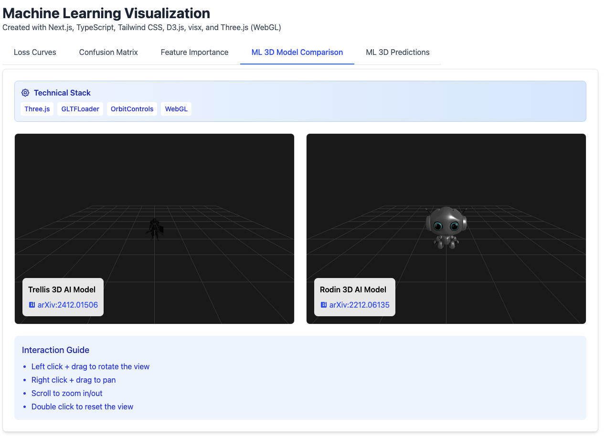

# ML Model Performance Visualization Portfolio

This interactive data visualization portfolio showcases advanced techniques for visualizing machine learning model performance metrics. Using low-level visualization frameworks including D3.js, visx, and WebGL, we demonstrate how to create insightful, interactive visualizations that help data scientists understand model behavior and performance.



## Visualizations Included

### 1. Loss Curves
The loss curve visualization tracks how model error changes during training. This fundamental visualization shows:

- **Training vs. Validation Loss**: Two lines tracking error on training data (used to update model weights) and validation data (unseen during training).
- **Convergence Patterns**: How quickly the model learns from data.
- **Overfitting Detection**: When validation loss increases while training loss continues to decrease, the model is memorizing training data rather than learning generalizable patterns.

The visualization supports interactive features like hovering for precise values and zooming to examine specific training epochs.

### 2. Confusion Matrix Heatmap

Confusion matrices are essential for understanding classification model performance beyond simple accuracy metrics:

- **Per-Class Performance**: Shows how well the model performs for each class.
- **Error Patterns**: Reveals which classes are frequently confused with each other.
- **Normalization Toggle**: Switches between raw counts and percentages for better comparison.

The color intensity in this heatmap indicates frequency, with darker blue cells representing more common predictions. The diagonal represents correct classifications, while off-diagonal cells represent errors.

### 3. Feature Importance Visualization

This visualization reveals which input features have the greatest influence on model predictions:

- **Relative Importance**: Features are ranked and sized according to their impact on predictions.
- **Feature Categories**: Color-coding distinguishes between numerical, categorical, and textual features.
- **Multiple Views**: Toggle between bar chart and parallel coordinates to understand relationships.

Understanding feature importance helps with feature selection, dimensionality reduction, and model interpretability.

### 4. 3D Model Predictions

The WebGL-powered 3D visualization shows model predictions in feature space:

- **Spatial Relationships**: View how data points cluster in three dimensions.
- **Classification Boundaries**: See where model makes correct vs. incorrect predictions.
- **Interactive Exploration**: Rotate, zoom, and filter to explore decision boundaries.
- **Confidence Visualization**: Point size represents prediction confidence.

This visualization is particularly valuable for understanding high-dimensional data and how models separate classes in feature space.

## ML Concepts Explained

### Model Training Dynamics

The loss curve visualization demonstrates how models learn over time. During training, models adjust their parameters iteratively to minimize error. Initially, both training and validation loss decrease rapidly, indicating the model is learning useful patterns. 

As training progresses, we may observe:

- **Healthy convergence**: Both curves flatten toward a minimum error rate
- **Underfitting**: Both curves remain high, indicating the model lacks capacity
- **Overfitting**: Training loss continues decreasing while validation loss increases, showing the model has memorized training examples rather than learning generalizable patterns

### Classification Performance Analysis

Classification models assign inputs to discrete categories. The confusion matrix visualization shows:

- **True positives/negatives**: Correct predictions (diagonal cells)
- **False positives/negatives**: Incorrect predictions (off-diagonal cells)

From this visualization, we can calculate precision (how many positive predictions were correct), recall (how many actual positives were identified), and F1-score (harmonic mean of precision and recall) for each class.

### Model Interpretability

Understanding why models make certain predictions is crucial for trust and debugging. The feature importance visualization reveals which inputs most influence predictions, helping to:

- Identify redundant features that can be removed
- Detect potential bias in model decision-making 
- Focus data collection efforts on the most influential variables
- Ensure model decisions align with domain knowledge

### High-Dimensional Data Representation

Machine learning often involves high-dimensional data that is difficult to visualize. The 3D prediction visualization uses dimensionality reduction techniques to project high-dimensional data into a 3D space while preserving important relationships between points. This helps identify:

- Clusters of similar samples
- Outliers or anomalies
- Decision boundaries between classes
- Areas where the model struggles to classify correctly

## Technical Implementation

This portfolio is built using modern web technologies:

- **Next.js** with App Router for the framework
- **TypeScript** for type safety and improved developer experience
- **Tailwind CSS** for responsive styling
- **D3.js** for low-level data visualization control
- **visx** for React-based visualization components
- **Three.js/WebGL** for interactive 3D visualizations

The visualizations are fully interactive, allowing users to explore model performance from different perspectives and gain deeper insights into model behavior.

## Getting Started

Clone the repository and install dependencies:

```bash
git clone https://github.com/yourusername/ml-visualization-portfolio.git
cd ml-visualization-portfolio
npm install
npm run dev
```

Navigate to http://localhost:3000 to explore the visualizations.

## Potential Applications

These visualization techniques can be applied to:

- Model development and debugging
- Performance comparison between model iterations
- Stakeholder communication and education
- Identifying opportunities for model improvement
- Detecting bias or fairness issues in model predictions

By combining these visualization techniques, data scientists can gain comprehensive insights into model behavior and make more informed decisions about model selection and improvement.